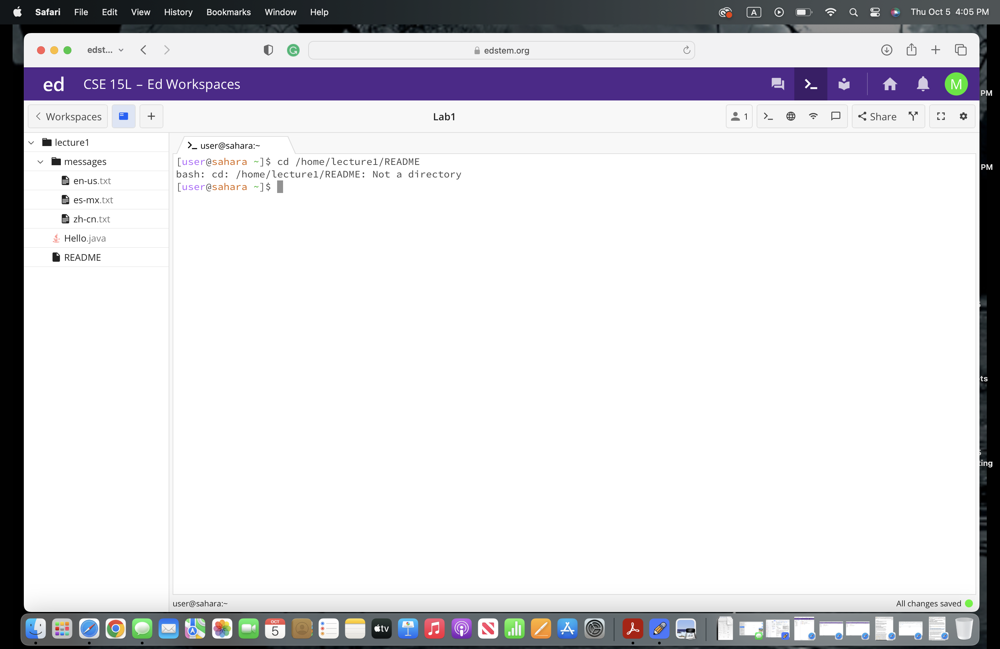

# Lab 1 Report

## cd with no arguments

* The working directory was /home when the cd command with no argument was run.

* It returns me to the home directory. I got this output because the cd command is used to change the current directory to the other directory that we want so it doesn't change if we don't give an argument.

* The output is not an error. 

## cd with a path to a directory

* The working directory was /home when the cd command with a path to a directory as an argument was run.

* It changed my current directory to lecture1. I got this output because the cd command is used to change the current directory to the other directory that we want.

* The output is not an error. 

## cd with a path to a file as an argument

* The working directory was /lecture1 when the cd command with a path to a file as an argument was run.

* I got this output because the cd command is used to change the current directory to the other directory that we want, so README is not a directory. 

* The output is an error because README is a file, not a directory. 
