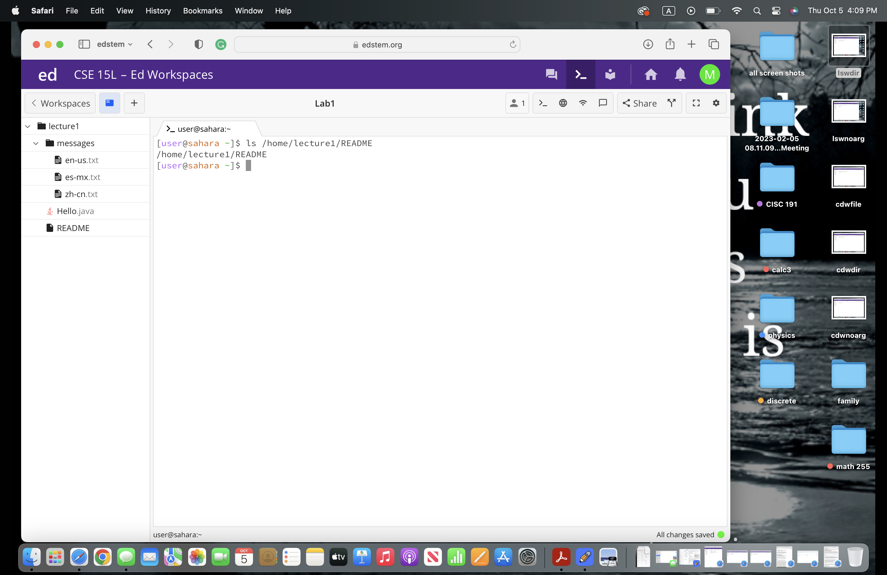

# Lab 1 Report by Momina Habibi

## cd command with no arguments

* The working directory was home when the cd command with no argument was run.

* It returns me to the home directory. I got this output because the cd command is used to change the current directory to the other directory that we want so it doesn't change it if we don't give an argument.

* The output is not an error. 

## cd command with a path to a directory as an argument

* The working directory was home when the cd command with a path to a directory as an argument was run.

* It changed my current directory to lecture1. I got this output because the cd command is used to change the current directory to the other directory that we want.

* The output is not an error. 

## cd command with a path to a file as an argument

* The working directory was home when the cd command with a path to a file as an argument was run.

* I got this output because the cd command is used to change the current directory to the other directory that we want, so README was not a directory it was a file

* The output is an error because README is a file, not a directory.

## ls command with no arguments

* The working directory was home when the ls command with no argument was run.

* I got this output because the ls command is used to show all the directories and files of the given path.

* The output is not an error. 

## ls command with a path to a directory as an argument

* The working directory was home when the ls command with a path to a directory as an argument was run.

* I got this output because I gave the path to the lecture1 directory so it shows me all the files and folders under the lecture1 directory. The ls command is used to show all the directories and files of the given path.

* The output is not an error.

## ls command with a path to a file as an argument

* The working directory was home when the ls command with a path to a file as an argument was run.

* I got this output because the ls command is used to show all the directories and files of the given path.

* The output is not an error.

## cat command with no arguments

* The working directory was home when the cd command with no argument was run.

* It returns me to the home directory. I got this output because the cd command is used to change the current directory to the other directory that we want so it doesn't change if we don't give an argument.

* The output is not an error. 

## cat command with a path to a directory as an argument

* The working directory was /home when the cd command with a path to a directory as an argument was run.

* It changed my current directory to lecture1. I got this output because the cd command is used to change the current directory to the other directory that we want.

* The output is not an error.

  

## cat command with a path to a file as an argument

* The working directory was /lecture1 when the cd command with a path to a file as an argument was run.

* I got this output because the cd command is used to change the current directory to the other directory that we want, so README is not a directory. 

* The output is an error because README is a file, not a directory.

